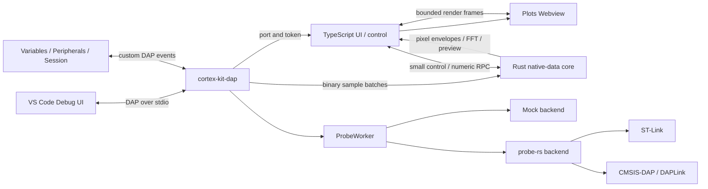

# Architecture

Cortex Kit is a new extension with its own protocol and project structure. MemRW3 supplied the design reference for the Rust data path, DWARF/SVD/FFT separation, and single-owner ProbeWorker. Cortex-Debug supplied only examples of VS Code interaction patterns.

The `cortex-kit-core` crate owns serializable state, ELF symbol and DWARF line metadata, SVD parsing, the expression grammar, and read planning. `cortex-kit-probe` owns probe-rs sessions and serializes every hardware operation on one thread. The pinned `vendor/probe-rs` 0.31.0 fork adds CMSIS-DAP packet-aware small-block and scattered-word transactions while retaining generic fallbacks for other probes. `cortex-kit-dap` implements Debug Adapter Protocol framing, the sample server, and the separate Rust native-data mode that owns CKIT decoding, history, derived expressions, FFT, display reduction, and CSV recording. TypeScript owns VS Code lifecycle, configuration, subscriptions, native trees, and bounded RPC forwarding; it never receives raw sample batches. `webview-ui` owns layout and drawing only.

Live Watch and Plot keep separate persisted variable selections. Plot dependencies form the high-rate Worker subscription; watch-only variables form a separate background subscription (20 S/s by default), even while Plot is active. Shared variables use the Plot samples without a second read. Both groups run on the same serialized Worker and emit independent real sample batches with their own measured timing. Background values are never repeated into Plot frames. Plot expressions are evaluated only on Plot batches. The native Live Watch tree separately throttles its UI refresh. With no plotted variables, the foreground subscription itself runs at the configured Live Watch rate.

Subscription changes and typed writes stay on the serialized Worker but do not halt a running target. A typed write flushes probe-side batching and reads the bytes back immediately for verification. Unchanged subscription sets are cached in the extension, so chart reordering, chart mode changes, and Webview reloads do not repeat target operations.

For a launch request, the adapter resolves `runToEntryPoint` (default `main`) from the selected ELF, temporarily installs a hardware breakpoint, runs only after DAP configuration is complete, then removes the temporary breakpoint and restores user breakpoints. The first stopped event is emitted only after the target has reached that symbol. Attach sessions keep their explicit `stopOnEntry` behavior without requiring an ELF entry symbol.

The Worker has separate urgent and normal queues. Disconnect, pause, reset, and stepping enter the urgent queue. Acquisition checks commands every 2 ms. A real acquisition burst borrows `Core` once, performs merged RAM block reads, decodes every subscribed variable, and drops the lexical borrow before another command can flash, reset, or disconnect. Peripheral and special regions are always isolated. There is no `Core<'static>` conversion and no unsafe code in Cortex Kit.

Every state update carries `sessionId`, `programGeneration`, `streamEpoch`, `stopId`, and `revision`. Continue increments the stream epoch; pause/reset close the current stream and increment the stop ID; flash increments the program generation. The extension rejects sample batches whose identifiers differ from the current state, so a delayed frame cannot contaminate a new firmware or stream segment.

DAP carries control and low-rate snapshots. Samples use an authenticated loopback TCP connection announced through a custom DAP event. Each binary frame contains a magic value and protocol version followed by session/program/stream identifiers, sequence and timing fields, dropped-frame count, channel identifiers, and interleaved `f64` values. The data server aggregates the Worker's short bursts into approximately 10 ms transmissions.

Chip differences enter through the probe-rs registry, target YAML support in probe-rs, ELF/DWARF, and SVD. No STM32H723VGT6 condition appears in the product code. With probe-rs 0.31, the built-in target selected for STM32H723VGT6 is `STM32H723VG`.
